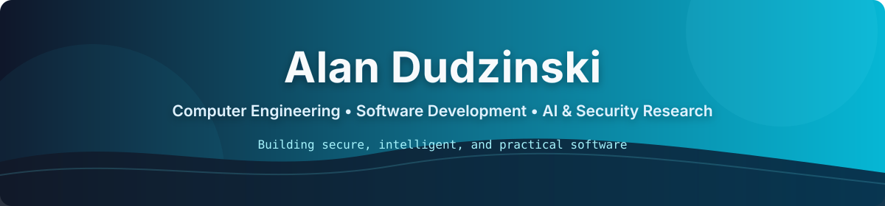

<p align="center">
  
</p>

<p align="center">
  <strong>Computer Engineering Student • Software Developer • Security Researcher</strong>
</p>

<p align="center">
  <a href="https://www.linkedin.com/in/alan-dudzinski-367311344/">
    
  </a>
  <!-- <a href="https://alandudzinski.com">
    
  </a> -->
  <a href="mailto:adudzinski177@gmail.com">
    
  </a>
</p>

---

## 👋 About Me

```yaml
name: Alan Dudzinski
education: Computer Engineering at Stevens Institute of Technology
location: New Jersey, USA

focus:
  - Software engineering
  - Artificial intelligence
  - Cybersecurity and networking
  - Backend systems

currently:
  - Researching security-related pull requests with a Stevens faculty advisor
  - Building backend features with the Stevens Software Engineering Club
  - Strengthening data structures, algorithms, and systems knowledge
```

I am a Computer Engineering student interested in building secure, intelligent, and practical software. My work currently spans backend development, cybersecurity research, network analysis, and AI-focused coursework.

---

## 🔬 Current Research

### Security-Related Pull Requests: Humans vs. Coding Agents

- Analyzing approximately **2,200 human- and agent-authored pull requests**
- Using **Python, pandas, and regular expressions** to clean, filter, and validate data
- Developing a security taxonomy to compare the frequency and distribution of security-related changes
- Conducting the research under the guidance of a Stevens faculty advisor

---

## 🚀 Featured Projects

<table>
<tr>
<td width="50%" valign="top">

### [ARP Spoofing Detection Scanner](https://github.com/alandudzinski/ARP-Scanner)

Python and Scapy network-security tool that detects:

- Changing IP-to-MAC mappings
- ARP and Ethernet header mismatches
- MAC addresses associated with multiple IPs
- Suspicious activity through structured logging

**Tech:** Python, Scapy, Networking

</td>
<td width="50%" valign="top">

### [Security Log Analyzer](https://github.com/alandudzinski/security-log-analyzer)

Processes login-event data from CSV files, stores it in SQLite, and classifies IP addresses by failed-login risk level.

- CSV ingestion and validation
- SQLite-backed event storage
- Risk classification and reporting
- Automated tests with pytest

**Tech:** Python, SQLite, pytest

</td>
</tr>

<tr>
<td width="50%" valign="top">

### [DHCP Packet Parser](https://github.com/alandudzinski/DHCP-Parser)

Parses DHCP traffic and extracts protocol information to support network inspection and analysis.

**Tech:** Python, Packet Analysis, Networking

</td>
<td width="50%" valign="top">

### Algorithm and AI Projects

Implemented projects involving:

- PageRank through sampling and iterative convergence
- Logical-inference Minesweeper AI
- Constraint propagation and knowledge representation
- Machine-learning classification with scikit-learn

**Tech:** Python, Algorithms, AI/ML

</td>
</tr>
</table>

---

## 🛠️ Technical Skills

### Languages

<p>
  
</p>

### Frameworks, Libraries, and Tools

<p>
  
</p>

**Additional:** pandas, Scapy, pytest, SQLite, regular expressions

---

## 🎓 Education and Coursework

**Stevens Institute of Technology**  
Bachelor of Engineering in Computer Engineering, expected May 2029

**HarvardX / CS50 Coursework**

- CS50's Introduction to Computer Science
- CS50's Introduction to Programming with Python
- CS50's Web Programming with Python and JavaScript
- CS50's Introduction to Artificial Intelligence with Python

---

## 🤝 Experience

### Backend Developer · Stevens Software Engineering Club

- Contribute to a platform connecting Stevens students with local employers
- Implemented approximately 20 Express routes and three middleware functions
- Collaborate with 10+ developers through pull requests, Scrum, and peer debugging

---

## 📫 Connect

<p>
  <a href="mailto:adudzinski177@gmail.com">Email</a> •
  <a href="https://www.linkedin.com/in/alan-dudzinski-367311344/">LinkedIn</a> •
  <!-- <a href="https://alandudzinski.com">Portfolio</a> -->
</p>

<p align="center">
  <em>Building toward a career in software engineering, AI, and secure systems.</em>
</p>
